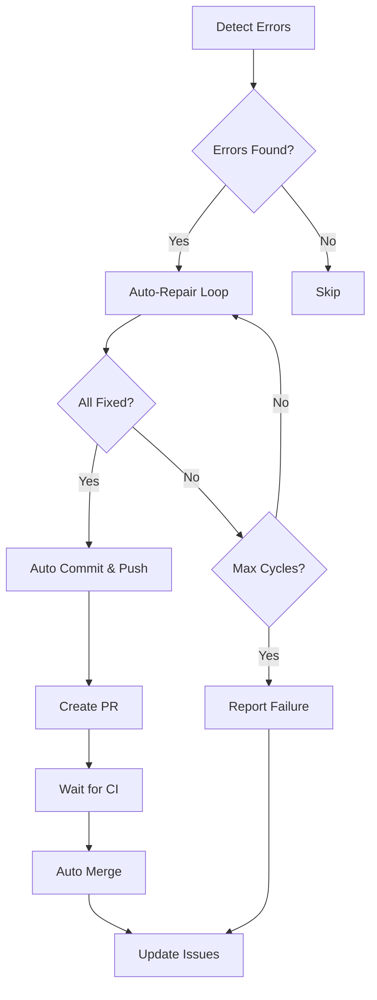

# 🤖 自動検知・修復ループシステム

## 概要

このシステムは、コードベースのエラーを自動的に検知し、修復を試みる**無限ループ修復システム**です。

### 主な機能

| 機能 | 説明 |
|------|------|
| 🔍 **全エラー自動検知** | 構文、インポート、Lint、テスト、DB、Flask等のエラーを包括的に検知 |
| 🔧 **自動修復** | 検知されたエラーを自動的に修復 |
| 🔄 **15サイクルループ** | 最大15回まで検知→修復のサイクルを繰り返す |
| 📤 **自動コミット・プッシュ** | 修復成功後、変更を自動的にコミット＆プッシュ |
| 🔀 **自動PR・マージ** | プルリクエストを自動作成し、CI通過後に自動マージ |
| ⏰ **30分間隔実行** | 30分ごとに自動実行（永続ループ） |

---

## アーキテクチャ

```
┌─────────────────────────────────────────────────────────────────┐
│                    GitHub Actions Workflow                       │
│                      (30分ごとに実行)                            │
├─────────────────────────────────────────────────────────────────┤
│                                                                   │
│  ┌─────────────┐    ┌─────────────┐    ┌─────────────┐          │
│  │   Detect    │───▶│   Repair    │───▶│   Commit    │          │
│  │   Errors    │    │   Loop      │    │   & Push    │          │
│  └─────────────┘    └─────────────┘    └─────────────┘          │
│        │                  │                  │                   │
│        ▼                  ▼                  ▼                   │
│  ┌─────────────┐    ┌─────────────┐    ┌─────────────┐          │
│  │ detect_all  │    │ infinite_   │    │  Auto PR    │          │
│  │ _errors.py  │    │ repair.py   │    │  & Merge    │          │
│  └─────────────┘    └─────────────┘    └─────────────┘          │
│                                                                   │
└─────────────────────────────────────────────────────────────────┘
                              │
                              ▼
                    ┌─────────────────┐
                    │  Issue Update   │
                    │  & Close        │
                    └─────────────────┘
```

---

## ワークフロー詳細

### トリガー条件

| トリガー | 条件 |
|----------|------|
| **Schedule** | 30分ごとに自動実行 (`*/30 * * * *`) |
| **Issue** | `auto-repair` ラベルが付いたIssueが作成/ラベル付けされた時 |
| **Manual** | GitHub Actions UIから手動実行 |

### ジョブフロー



---

## 検知可能なエラータイプ

| エラータイプ | 説明 | 自動修復 |
|------------|------|----------|
| `syntax_error` | Python構文エラー | ❌ |
| `import_error` | インポートエラー | ✅ (パッケージインストール) |
| `lint_error` | Lint違反 (flake8) | ✅ (black/isort) |
| `type_error` | 型エラー (mypy) | ❌ |
| `test_failure` | テスト失敗 | ❌ |
| `database_error` | DB接続エラー | ✅ (DB初期化) |
| `flask_error` | Flask起動エラー | ✅ (設定修復) |
| `template_error` | テンプレートエラー | ❌ |
| `security_error` | セキュリティ問題 | ⚠️ (一部) |
| `dependency_error` | 依存関係エラー | ✅ (pip install) |

---

## 使用方法

### 1. Issueから自動修復をトリガー

1. GitHubで新しいIssueを作成
2. テンプレート「🤖 Auto-Repair Request」を選択
3. エラー詳細を入力
4. `auto-repair` ラベルが自動的に付与される
5. GitHub Actionsが自動的に起動

### 2. 手動で実行

```bash
# GitHub Actions UIから
# Actions → Auto-Repair System → Run workflow

# またはローカルで直接実行
python scripts/infinite_repair_loop.py --max-cycles 15 --auto-commit
```

### 3. エラー検知のみ実行

```bash
# JSON出力
python scripts/detect_all_errors.py --output-json

# 詳細出力
python scripts/detect_all_errors.py --verbose
```

---

## 設定

### 環境変数

| 変数名 | 説明 | 必須 |
|--------|------|------|
| `GITHUB_TOKEN` | GitHub API トークン | ✅ |
| `SECRET_KEY` | Flask シークレットキー | ✅ |
| `FLASK_ENV` | Flask 環境 | ❌ |

### ワークフロー設定

```yaml
env:
  MAX_REPAIR_CYCLES: 15        # 最大修復サイクル数
  REPAIR_INTERVAL_SECONDS: 60  # サイクル間の待機時間
  PYTHON_VERSION: '3.11'       # Pythonバージョン
```

---

## Issueラベル

| ラベル | 説明 |
|--------|------|
| `auto-repair` | 自動修復対象 |
| `manual-repair` | 手動対応必要（自動修復スキップ） |
| `automated` | 自動生成されたもの |

---

## トラブルシューティング

### 自動修復が動作しない

1. **ラベルを確認**: `auto-repair` ラベルが付いているか確認
2. **Secrets確認**: `GITHUB_TOKEN` と `SECRET_KEY` が設定されているか確認
3. **ログ確認**: Actions の実行ログを確認

### 最大サイクルに達した

1. Issue に `manual-repair` ラベルが自動で追加されます
2. 手動でエラーを調査・修復してください
3. 修復後、`manual-repair` ラベルを削除すると自動修復が再開

### 自動マージが失敗

1. ブランチ保護ルールを確認
2. 必要なレビュー数を確認
3. CI チェックが通っているか確認

---

## ローカルでのテスト

```bash
# エラー検知テスト
python scripts/detect_all_errors.py --verbose

# 修復ループテスト（コミットなし）
python scripts/infinite_repair_loop.py --max-cycles 3

# フルテスト
python scripts/infinite_repair_loop.py --max-cycles 15 --auto-commit --output-json
```

---

## ログと成果物

### GitHub Actions Artifacts

各実行で以下の成果物が保存されます（7日間保持）:

- `detection-results-{run_number}`: エラー検知結果
- `repair-logs-{run_number}`: 修復ログ

### ログファイル

```
logs/
├── auto_repair/
│   ├── repair_2024-01-01_12-00-00.log
│   └── ...
└── health_checks/
    ├── health_2024-01-01_12-00-00.json
    └── ...
```

---

## セキュリティ考慮事項

⚠️ **注意**: 自動修復システムは以下の点に注意してください:

1. **機密情報**: 自動コミットに機密情報が含まれないよう注意
2. **コード品質**: 自動修復されたコードは手動レビューを推奨
3. **アクセス権限**: 最小権限の原則に従ってトークンを設定

---

## 関連ファイル

```
.github/
├── workflows/
│   └── auto-repair.yml          # メインワークフロー
└── ISSUE_TEMPLATE/
    ├── auto-repair.yml          # 自動修復リクエスト
    └── bug_report.yml           # バグ報告

scripts/
├── infinite_repair_loop.py      # 無限ループ修復システム
├── detect_all_errors.py         # 包括的エラー検知
├── auto_repair.py               # 従来の自動修復（Issue連携）
└── health_check.py              # ヘルスチェック
```

---

## 更新履歴

### 2025-12-02

- 無限ループ修復システム初期実装
- 最大15サイクル対応
- 30分間隔スケジュール実行
- 自動コミット・プッシュ・マージ機能
- GitHub Issue テンプレート追加

---

🤖 Generated by Auto-Repair System
